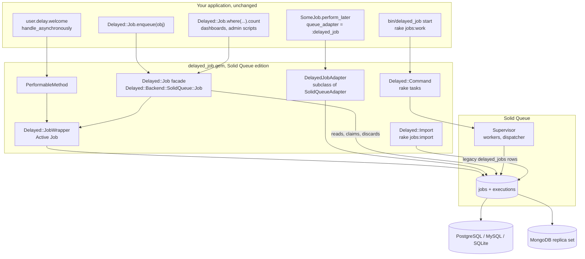

# delayed_job on Solid Queue

A drop-in replacement for [delayed_job](https://github.com/collectiveidea/delayed_job) 4.2. It keeps delayed_job's public API (`obj.delay.method`, `handle_asynchronously`, `Delayed::Job`, `Delayed::Worker`, `bin/delayed_job`, `rake jobs:*`) and stores and runs every job with [Solid Queue](https://github.com/alexandernicholson/solid_queue), on SQL or MongoDB.

The gem is named `delayed_job` (version `4.2.0.sq1`), so application code doesn't change.

## Architecture



## Install

1. **Gemfile.** Swap the delayed_job gems for this one and Solid Queue:

   ```ruby
   # remove: gem "delayed_job", gem "delayed_job_active_record", gem "delayed_job_mongoid", gem "daemons"
   gem "delayed_job", github: "alexandernicholson/delayed_job", branch: "solid-queue-shim"
   gem "solid_queue", github: "alexandernicholson/solid_queue"
   ```

2. **Active Job adapter.** Either setting works:

   ```ruby
   config.active_job.queue_adapter = :delayed_job  # the shim's adapter, which enqueues into Solid Queue
   config.active_job.queue_adapter = :solid_queue  # same storage, Solid Queue's own adapter
   ```

3. **Solid Queue storage.**

   ```sh
   bin/rails solid_queue:install   # add --backend=mongodb for MongoDB
   bin/rails solid_queue:prepare   # db:prepare on SQL, collections and indexes on MongoDB
   ```

4. **Existing jobs.** Move waiting rows out of the old table ([docs/import.md](docs/import.md)):

   ```sh
   bin/rails jobs:import
   ```

5. **Workers.** Keep your existing scripts ([docs/commands.md](docs/commands.md)):

   ```sh
   bin/rails g delayed_job          # (re)creates bin/delayed_job
   bin/delayed_job start -n 2 --queues=mailers,default
   bin/rails jobs:work
   ```

   `bin/jobs` (Solid Queue's own CLI) runs the same jobs too.

## What maps to what

| delayed_job | Solid Queue |
|---|---|
| `delayed_jobs` row | a Solid Queue job, plus its ready, scheduled, claimed, blocked or failed execution |
| `Delayed::Job` model | facade over every unfinished Solid Queue job ([docs/job.md](docs/job.md)) |
| `handler` YAML | the payload in `Delayed::JobWrapper`'s Active Job arguments; records go through GlobalID |
| `priority`, `queue`, `run_at` | `priority`, `queue_name`, `scheduled_at` |
| `attempts` | Active Job `executions` |
| `last_error`, `failed_at` | failed execution error and time |
| `locked_by`, `locked_at` | claiming process name and claim time |
| `Delayed::Worker` process | Solid Queue worker process with one thread, under a supervisor |
| `sleep_delay` | worker `polling_interval` |
| `min_priority`, `max_priority`, `queues` | worker `min_priority`, `max_priority`, `queues` |
| `exit_on_complete`, `jobs:workoff` | worker `exit_on_complete` |
| `max_run_time` | Solid Queue run-time watchdog |
| stale lock re-run | Solid Queue death recovery retry |
| `bin/delayed_job start/stop/restart/status/run/zap` | supervisor with a pidfile, managed by `Delayed::Command` |
| `jobs:check[max_age]` | `solid_queue:check_latency[max_age]` |
| `jobs:clear` | `solid_queue:clear` |
| `ActiveJob::QueueAdapters::DelayedJobAdapter` | subclass of `SolidQueueAdapter` that keeps delayed_job's `"MyJob [id] from DelayedJob(queue)"` names |

## Observability

- Solid Queue's `*.solid_queue` events keep flowing.
- The shim publishes `enqueue`, `perform`, `retry`, `failure` and `timeout` events as `*.delayed_job`.
- `command.delayed_job` wraps every `bin/delayed_job` command, and `import.delayed_job` reports each import run.

## Not included

- Capistrano recipes (`delayed/recipes.rb` raises `NotImplementedError`; see [docs/commands.md](docs/commands.md)).
- The `daemons` gem and per-worker pidfiles. One supervisor owns all of a command's worker processes.
- Arbitrary YAML objects in handlers. Permit your classes in `Delayed::Backend::Base::HandlerLoader.permitted_classes` ([docs/job.md](docs/job.md#handlers-and-yaml)).

## Development

```sh
SOLID_QUEUE_PATH=../solid_queue SOLID_QUEUE_BACKEND=active_record bundle exec rake test
SOLID_QUEUE_PATH=../solid_queue SOLID_QUEUE_BACKEND=mongodb MONGODB_URI="mongodb://127.0.0.1:27017/dj_test?replicaSet=rs0" bundle exec rake test
bundle exec rubocop
```

CI runs both backends on two Ruby and Rails lanes ([docs/ci.md](docs/ci.md)).
