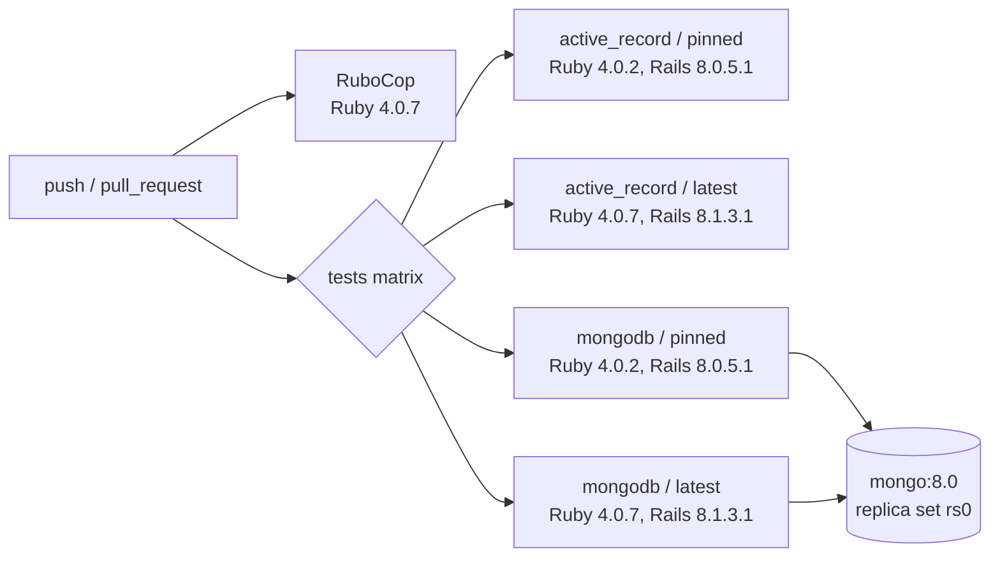

# CI

`.github/workflows/ci.yml` runs on every push and pull request.



## Jobs

| Job | What it runs |
|---|---|
| `rubocop` | `bundle exec rubocop --parallel` with `rubocop-rails-omakase` |
| `tests` | `bundle exec rake test` with `SOLID_QUEUE_BACKEND` set to `active_record` or `mongodb`, on both lanes |

Every job clones `alexandernicholson/solid_queue@main` into `../solid_queue` and points `SOLID_QUEUE_PATH` at it, which is where the `Gemfile` looks for Solid Queue. `RAILS_VERSION` selects the Rails gems.

The MongoDB lanes start `mongo:8.0` as a single-node replica set (`rs0`), since Solid Queue's MongoDB backend needs transactions. They wait for `isWritablePrimary` and connect through `MONGODB_URI=mongodb://127.0.0.1:27017/delayed_job_shim_test?replicaSet=rs0`. The SQL lanes use SQLite files in a temporary directory, so they need no service.

## Running the same thing locally

```sh
SOLID_QUEUE_PATH=../solid_queue SOLID_QUEUE_BACKEND=active_record bundle exec rake test
SOLID_QUEUE_PATH=../solid_queue SOLID_QUEUE_BACKEND=mongodb \
  MONGODB_URI="mongodb://127.0.0.1:27017/delayed_job_shim_test?replicaSet=rs0" bundle exec rake test
bundle exec rubocop
```

## Tests that wait for Solid Queue core

Some tests skip themselves until the Solid Queue core features in `docs/delayed_job/core.md` land, for example `skip "needs Solid Queue exit_on_complete"`. They check for the feature at run time, so they start running as soon as CI picks up a Solid Queue `main` that has it.
