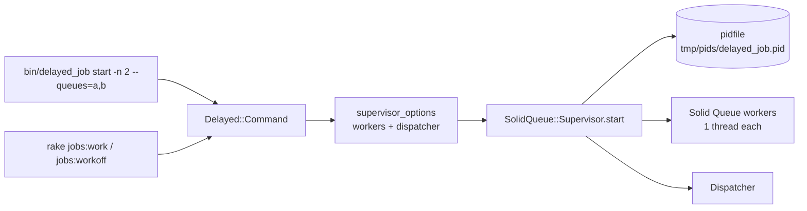

# `bin/delayed_job` and rake tasks

`rails g delayed_job` writes `bin/delayed_job`, which calls `Delayed::Command.new(ARGV).daemonize` like delayed_job 4.2. The command runs a Solid Queue supervisor instead of `daemons`, so remove `gem "daemons"`.



## Commands

| Command | What it does |
|---|---|
| `start` | Forks, calls `Process.daemon`, and runs the supervisor with `SolidQueue.supervisor_pidfile` set. It waits up to 30 seconds for the pidfile, then prints `delayed_job: process with pid N started.` It exits 1 if the supervisor is already running |
| `stop` | Sends `TERM` and waits `SolidQueue.shutdown_timeout + 10` seconds, then `KILL`. A stale pidfile is removed |
| `restart` | `stop` then `start` |
| `status` | Prints `delayed_job: running [pid N]`, or exits 1 with `delayed_job: not running` |
| `run` | Runs the supervisor in the foreground, inside the `:execute` lifecycle callbacks |
| `zap` | Deletes the pidfile |

Each command publishes `command.delayed_job` with `command`, `pidfile`, `pidfiles` and `supervisor` (the configuration hash).

### `--exit-on-complete` with several workers

A Solid Queue worker in drain mode stops its whole supervisor once its own queues are empty. So when `--exit-on-complete` is combined with `-n` greater than 1 or with `--pool`, each worker process gets its own supervisor (with its own dispatcher), named `delayed_job.0`, `delayed_job.1`, ... like delayed_job's daemons. Each one exits when its own queues drain, and the others keep running. `start`, `stop`, `status` and `zap` act on all of those pidfiles, so pass the same flags you started with (`bin/delayed_job -n 2 --exit-on-complete stop`). `run` forks one foreground supervisor per worker, forwards `TERM`, `INT` and `QUIT` to them, and returns when all have exited.

## Flags

| Flag | Solid Queue |
|---|---|
| `-n`, `--number_of_workers=N` | one worker entry with `processes: N, threads: 1`, since a delayed_job worker runs one job at a time |
| `--pool=queue1,queue2:N` (repeatable) | one worker entry per pool with `processes: N`. `*` or an empty list means all queues |
| `--queues=a,b`, `--queue=a` | worker `queues`. When empty: `Delayed::Worker.queues`, else `"*"` |
| `--min-priority N`, `--max-priority N` | worker `min_priority` / `max_priority` (falls back to `Delayed::Worker`) |
| `--sleep-delay N` | worker `polling_interval` (falls back to `Delayed::Worker.sleep_delay`, then Solid Queue's 0.1s) |
| `--exit-on-complete` | worker `exit_on_complete: true`: the supervisor stops once the worker's queues are drained |
| `-p`, `--prefix NAME` | `SolidQueue.procline_prefix` (`config.solid_queue.procline_prefix`) |
| `--pid-dir=DIR` | pidfile directory (default `Rails.root/tmp/pids`). Relative paths are expanded from the directory the command runs in |
| `-i`, `--identifier=N` | pidfile name `delayed_job.N.pid`. Can't be combined with `-n` greater than 1, as in delayed_job |
| `--log-dir=DIR` | `Delayed::Worker.logger` becomes `DIR/delayed_job.log` when no logger is set |
| `--read-ahead N` | passed to `Delayed::Worker.new` as `read_ahead` |
| `-m`, `--monitor` | accepted; the supervisor already replaces crashed workers |
| `--daemon-options a,b` | accepted and ignored, as there is no `daemons` gem |
| `-e`, `--environment` | prints delayed_job's deprecation warning and has no effect |
| `-h`, `--help` | prints usage and exits 1 |

The dispatcher uses Solid Queue's defaults. Other Solid Queue settings come from `config/queue.yml` only when you run `bin/jobs` directly; `bin/delayed_job` builds its own worker list from the flags.

### Differences from delayed_job

- `-n 3` runs one supervisor with three worker processes and one pidfile, instead of three daemons with `delayed_job.0.pid` to `delayed_job.2.pid`. `stop` stops all of them. With `--exit-on-complete` you get one supervisor per worker instead, as described above.
- `--min-priority`, `--max-priority`, `--exit-on-complete` and `--prefix` use Solid Queue's priority-range claims, drain mode and procline prefix, so they need a Solid Queue with those features (on `main` since the delayed_job core work).

## Rake tasks

| Task | Solid Queue |
|---|---|
| `jobs:work` | `Delayed::Command.new(["run"], options).daemonize`: a foreground supervisor |
| `jobs:workoff` | the same with `exit_on_complete: true` |
| `jobs:environment_options` | reads `MIN_PRIORITY`, `MAX_PRIORITY`, `QUEUES` (or `QUEUE`), `QUIET`, `SLEEP_DELAY`, `READ_AHEAD` |
| `jobs:check[max_age]` | `solid_queue:check_latency[max_age]` (default 300): prints `OK: ...`, or prints the count and oldest wait to stderr and exits 1 |
| `jobs:clear[queue]` | `solid_queue:clear[queue]`: discards ready, scheduled, blocked and failed jobs in one queue or all. Claimed jobs are left to finish |
| `jobs:import` | `Delayed::Import.run(batch_size: BATCH_SIZE || 500, table_name: TABLE || "delayed_jobs")`, see `import.md` |

## Capistrano

`delayed/recipes.rb` raises `NotImplementedError`. Call the commands from your deploy tool instead:

```sh
RAILS_ENV=production bin/delayed_job restart -n 2
```
