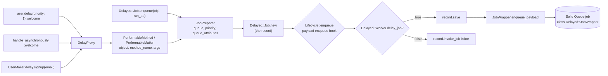

# Enqueuing jobs

Every way delayed_job 4.2 queues work is here: `delay`, `send_later`, `send_at`, `handle_asynchronously`, mailers and `Delayed::Job.enqueue` with custom job objects. Solid Queue stores and runs each one as a `Delayed::JobWrapper` Active Job, on SQL or MongoDB.



## `delay`

```ruby
user.delay.welcome("hi")
User.delay(queue: "mailers", priority: 5, run_at: 1.hour.from_now).cleanup
"hello".__delay__.count("l")
```

`delay(options = {})` is on every object and returns a `Delayed::DelayProxy`. Any method called on the proxy becomes a job: the proxy builds `Delayed::PerformableMethod.new(target, method, args)` and calls `Delayed::Job.enqueue(payload_object: ..., **options)`. The return value is the job, a `Delayed::Job` record, as in delayed_job. `__delay__` is an alias for code that defines its own `delay`.

Options:

| Option | Meaning |
|---|---|
| `priority` | Lower runs first. Default `Delayed::Worker.default_priority`, or the queue's `queue_attributes` priority. |
| `queue` | Queue name. Default: the payload's `queue_name`, then `Delayed::Worker.default_queue_name`, then Solid Queue's `default`. |
| `run_at` | Earliest run time. Default: now. |
| `delivery_mode` | `:exactly_once`, `:at_least_once` or `:at_most_once`. Default `Delayed::Worker.delivery_mode`. See [delivery modes](retries.md#delivery-modes). |

`DelayProxy` is a `BasicObject` that keeps only `__id__`, `__send__`, `instance_eval` and `instance_exec`, so even `==` and `!` are delayed. `raise` works inside it. Calling a method the target does not respond to raises `NoMethodError` at enqueue time; private methods are allowed.

Delaying an unsaved or destroyed record raises `ArgumentError, "job cannot be created for non-persisted record: #<...>"`.

## `send_later` and `send_at`

```ruby
user.send_later(:welcome, "hi")
user.send_at(1.hour.from_now, :welcome, "hi")
```

Both print delayed_job's deprecation warnings to stderr and behave like `delay.welcome("hi")` and `delay(run_at: time).welcome("hi")`.

## `handle_asynchronously`

```ruby
class User
  def welcome(message) = ...
  handle_asynchronously :welcome, queue: "mailers", priority: proc { |user| user.vip? ? 0 : 10 }, run_at: -> { 5.minutes.from_now }
end

user.welcome("hi")
user.welcome_without_delay("hi")
```

`handle_asynchronously(method, opts = {})` renames the method to `method_without_delay` and defines `method_with_delay`, which calls `delay(opts).method_without_delay(*args)`. The original name now points at the delayed version, with the original visibility (public, protected or private).

Punctuation stays at the end: `tell!` becomes `tell_with_delay!` / `tell_without_delay!`; the same goes for `?` and `=`.

Any option value may be a proc, evaluated on every call:

- arity 1: called with the instance, `proc { |user| user.importance }`
- any other arity: called with no arguments, `proc { importance }` or `-> { 1.hour.from_now }`

## Mailers

```ruby
UserMailer.delay.signup("john@example.com")
UserMailer.with(account: account).delay(queue: "mailers").signup("john@example.com")
```

`ActionMailer::Base` classes and parameterized mailers (`MyMailer.with(...)`) get `Delayed::DelayMail#delay`, which builds a `Delayed::PerformableMailer`. When it runs it calls the mailer action and then `deliver_now` (or `deliver` when that is all the message has).

Calling `delay` on a built message raises `RuntimeError, "Use MyMailer.delay.mailer_action(args) to delay sending of emails."`, as in delayed_job.

## `Delayed::Job.enqueue` and custom job objects

```ruby
class NewsletterJob < Struct.new(:text, :emails)
  def perform = emails.each { |e| NewsletterMailer.deliver_text_to_email(text, e) }
  def queue_name = "newsletters"
  def max_attempts = 3
  def max_run_time = 2.minutes
  def reschedule_at(now, attempts) = now + attempts.hours
  def destroy_failed_jobs? = false
  def display_name = "Newsletter"
  def delivery_mode = :at_least_once
  def enqueue(job) = job.priority = 1
  def before(job) = ...
  def after(job) = ...
  def success(job) = ...
  def error(job, exception) = ...
  def failure(job) = ...
end

Delayed::Job.enqueue NewsletterJob.new("hi", emails), queue: "mail", priority: 3, run_at: 5.minutes.from_now
Delayed::Job.enqueue payload_object: NewsletterJob.new("hi", emails)
Delayed::Job.enqueue NewsletterJob.new("hi", emails), 3, 5.minutes.from_now
```

Any object with `perform` can be a payload. The positional `(priority, run_at)` form prints delayed_job's deprecation warning. Payloads without `perform` raise `ArgumentError, "Cannot enqueue items which do not respond to perform"`. The options hash you pass in is never modified.

### Options: `Delayed::Backend::JobPreparer`

`JobPreparer.new(*args).prepare` normalises the arguments exactly as delayed_job does:

1. `payload_object` from the options, or the first positional argument.
2. `queue`: the given `queue`, else the payload's `queue_name`, else `Delayed::Worker.default_queue_name`.
3. `priority`: the given `priority`, else `Delayed::Worker.queue_attributes[queue][:priority]`, else `Delayed::Worker.default_priority`.
4. Positional `priority` and `run_at` (deprecated) override the hash.

### Hooks

Hooks are optional methods on the payload. Each one is called with no arguments if it takes none, else with the job (plus the error for `error`):

| Hook | When |
|---|---|
| `enqueue(job)` | Before the job is stored; it may change `job.run_at`, `job.priority` or `job.queue`. |
| `before(job)` | Before `perform`. |
| `success(job)` | After `perform` returns. |
| `error(job, exception)` | When `before`, `perform` or `success` raises. The exception is re-raised. |
| `after(job)` | Always, after the above. |
| `failure(job)` | When the job has used all its attempts. See [retries](retries.md). |

A `PerformableMethod` forwards hooks to its target, so `user.delay.welcome` calls `user.before(job)` if `User#before` exists.

### `delay_jobs`

`Delayed::Worker.delay_jobs = false` runs every job inline at enqueue time through `invoke_job` (with hooks) and stores nothing. A proc decides per job: `->(job) { job.queue != "inline" }` receives the job; a zero-arity proc is called without it. Exceptions from inline jobs propagate to the caller. `Delayed::Job.enqueue` still returns the job.

## Serialization

Payloads travel as Active Job arguments, so they survive restarts and deploys:

| Value | Stored as |
|---|---|
| Active Record records, Mongoid documents, anything with `GlobalID::Identification` | GlobalID; reloaded when the job runs |
| Classes and modules | Their name |
| Strings, numbers, symbols, hashes, arrays, times, dates, durations, ranges, BigDecimal | Active Job's own serializers |
| `PerformableMethod` / `PerformableMailer` | Class, target, method name and arguments, each serialized as above |
| Other objects of named classes defined in Ruby code (your job classes, `Struct`s, `Data`) inside a payload | Class name, members and instance variables, each serialized as above |

Anonymous classes, procs, IO objects, core objects whose state lives in C (such as `Set`, `Regexp` and exceptions) and other values Active Job cannot represent raise `ActiveJob::SerializationError` at enqueue time.

A record that has been deleted by the time the job runs raises `Delayed::DeserializationError` ("Job failed to load: ...") from `payload_object`. The job fails permanently without retries, as in delayed_job. `job.name` still reports the payload class (`Delayed::PerformableMethod`).

`require "delayed_job"` makes Mongoid documents GlobalID-identifiable when Mongoid is loaded, so they can be delay targets and arguments.

## The job object

`Delayed::Job.enqueue`, `delay` and `handle_asynchronously` return a `Delayed::Job` record (`nil` `id` for inline jobs). It has delayed_job's attributes and methods, read from Solid Queue; see [`Delayed::Job`](job.md). The `enqueue` hook, the `:enqueue` and `:invoke_job` lifecycle events and the `delay_jobs` proc receive this record. `job.reload` re-reads it, following retries, so `attempts`, `run_at`, `last_error` and `failed_at` show the latest attempt. `job.delivery_mode` is the job's [delivery mode](retries.md#delivery-modes).

In Solid Queue the job is stored as a `Delayed::JobWrapper` Active Job. When a worker runs it, the wrapper is the job that the `before`, `success`, `error`, `after` and `failure` hooks and the `:perform`, `:error` and `:failure` lifecycle events receive. It has the same readers as the record (`id`, `name`, `queue`, `priority`, `run_at`, `attempts`, `payload_object`, `error`, `last_error`, `locked_at`, `locked_by`) plus `job_id`, the Active Job id, which stays the same across retries. Its `handler` is the payload's YAML, or, when the payload can't be loaded, a `--- !ruby/object:PayloadClass {...}` document holding the serialized payload.

Solid Queue lists these jobs with class `Delayed::JobWrapper` and uses the payload's display name in its logs. `Delayed::JobWrapper.log_arguments` is false, so Active Job's enqueue and perform log lines name the job without printing the payload or its records.

## `Delayed::JobWrapper.enqueue_payload` contract

`Delayed::Job.enqueue(*args)` prepares the options, builds the record and runs the enqueue hook, lifecycle and `delay_jobs` decision (`Delayed::Backend::Base.enqueue_job`). Saving a new record then stores it with this method:

```ruby
Delayed::JobWrapper.enqueue_payload(record.payload_object, queue:, priority:, run_at:, attempts:, job_id:, delivery_mode:)
```

`Delayed::JobWrapper.enqueue_payload(payload_object, options = {}) -> Delayed::JobWrapper`

- `payload_object`: any object responding to `perform`. It is not validated here; `JobPreparer` does that.
- `options` (read-only):
  - `:queue`: queue name. `nil` means Solid Queue's `default`.
  - `:priority`: Integer or `nil`.
  - `:run_at`: Time or `nil` (now).
  - `:attempts`: Integer starting value for `attempts`/`executions` (optional, for imports).
  - `:job_id`: Active Job id to use (optional, for idempotent imports).
  - `:delivery_mode`: `:at_least_once`, `:at_most_once` or `:exactly_once` (optional; unknown values raise `ArgumentError`). Stored in the serialized job as `"delivery_mode"`.
  - `:payload_object` and any other keys are ignored.
- It builds the job, applies the options and stores it in Solid Queue, wrapped in the `enqueue.delayed_job` notification. It runs no hooks or lifecycle callbacks and ignores `delay_jobs`.
- It returns the job. If Solid Queue rejects it (a deduplicated duplicate, say), `provider_job_id` is `nil` and the record's `save` returns `false`.
