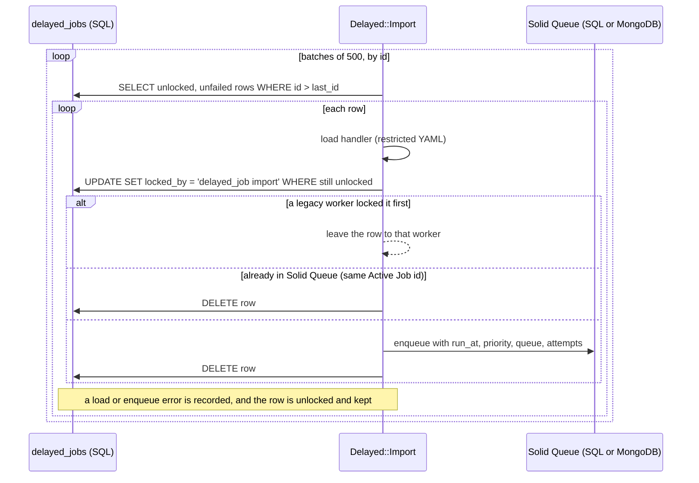

# Importing a legacy `delayed_jobs` table

`rake jobs:import` moves waiting jobs from delayed_job's `delayed_jobs` table into Solid Queue, so you can switch over without draining the old queue first.



## What moves

- Only rows with `locked_by`, `locked_at` and `failed_at` all `NULL`. Rows a running delayed_job worker holds, and failed rows, stay where they are.
- Each row is locked (`locked_by = 'delayed_job import'`) with a conditional `UPDATE` before it's enqueued, so it's safe to run the import while old delayed_job workers are still running: a row they lock first is left to them, and they skip rows the import holds. If the import is interrupted, the next run picks its locked rows up again.
- `run_at` becomes `scheduled_at`, and `priority`, `queue` and `attempts` (as Active Job `executions`) are kept.
- **Active Job rows** (the Rails adapter's `JobWrapper`) are enqueued as the original Active Job, keeping its `job_id`.
- **Other payloads** (`PerformableMethod`, custom job objects) go through `Delayed::JobWrapper.enqueue_payload` with `delayed_job:<table>:<id>` as the Active Job id.
- Each row is deleted as soon as its job is enqueued.

## Idempotency

Before enqueueing, the importer looks up the row's Active Job id in Solid Queue: the wrapped job's `job_id`, or `delayed_job:<table>:<id>` for other payloads. If a job with that id exists, the importer only deletes the row. A crash between enqueueing and deleting is safe to re-run, and importing a second table whose ids overlap the first doesn't skip anything.

## Rows that are skipped

A row is skipped when its handler can't load. That happens when the class no longer exists, the class isn't permitted, a referenced record was deleted, the YAML is invalid, or the Active Job class is gone. Skipped rows stay in the table. The result reports them:

```ruby
result = Delayed::Import.run
result.imported          # => 1200
result.already_imported  # => 3
result.skipped           # => 2
result.skipped_ids       # => [41, 97]
result.errors            # => { 41 => "NameError: uninitialized constant RemovedJob", ... }
```

To load custom job classes, permit them first, for example in an initializer:

```ruby
Delayed::Backend::Base::HandlerLoader.permitted_classes += [NewsletterJob, ReportJob]
```

or pass them per run: `Delayed::Import.run(permitted_classes: [NewsletterJob])`.

## Options

| Option | Default | Rake env |
|---|---|---|
| `batch_size:` | `500` | `BATCH_SIZE` |
| `table_name:` | `"delayed_jobs"` | `TABLE` |
| `connection:` | `ActiveRecord::Base.connection` | n/a |
| `permitted_classes:` | `[]` | n/a |

The source must be a SQL table reachable through Active Record. The target is whichever Solid Queue backend is configured, so an app moving to MongoDB can import from its old SQL database:

```ruby
class LegacyDatabase < ActiveRecord::Base
  self.abstract_class = true
  establish_connection :legacy
end

Delayed::Import.run(connection: LegacyDatabase.connection)
```

## Observability

One `import.delayed_job` notification wraps the run. When it finishes, the payload holds `table_name`, `batch_size`, `imported`, `already_imported`, `skipped`, `skipped_ids` and `batches`.

```ruby
ActiveSupport::Notifications.subscribe("import.delayed_job") do |event|
  Rails.logger.info("delayed_job import: #{event.payload.slice(:imported, :skipped, :batches)} in #{event.duration.round}ms")
end
```
