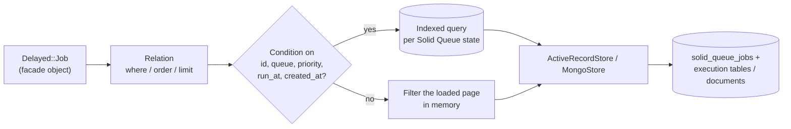

# `Delayed::Job` on Solid Queue

`Delayed::Job` is `Delayed::Backend::SolidQueue::Job`. It has no table of its own: every read and write goes to Solid Queue through the same code on the SQL and MongoDB backends. It covers **every unfinished Solid Queue job**, including plain Active Job jobs that never went through delayed_job.

## Attributes

| delayed_job attribute | Read from | Written by `save` / `update` |
|---|---|---|
| `id` | Solid Queue job id (Integer on SQL, ObjectId string on MongoDB) | n/a |
| `priority` | `priority` | job `priority`, plus the ready or scheduled row |
| `queue` | `queue_name` | job `queue_name` |
| `run_at` | `scheduled_at` (falls back to `created_at`) | `scheduled_at`; a future time makes the job scheduled, a past time makes it ready |
| `attempts` | Active Job `executions`, +1 while the job is failed (Solid Queue keeps the arguments from before the failing run) | `executions` in the serialized job |
| `handler` | YAML of the payload: `Delayed::JobWrapper`'s handler (the payload's YAML, or a `!ruby/object:`-tagged document of the serialized payload when it can't load), else `ActiveJob::QueueAdapters::DelayedJobAdapter::JobWrapper` around the Active Job data. A new job builds it from `payload_object` when read | the payload, when a new job is saved |
| `payload_object` | `Delayed::JobWrapper#payload_object`, else the adapter `JobWrapper` (so `name` is `"MyJob [id] from DelayedJob(queue) with arguments: [...]"`) | see `save` |
| `name` | `payload_object.display_name`, else the payload class name; the `!ruby/object:` tag of the handler when the payload can't load | n/a |
| `last_error` | failed execution `error` as `"message\nbacktrace"`, or `last_error` stored in the serialized job by a reschedule | `last_error` in the serialized job, or the failed execution error when `failed_at` is set |
| `failed_at` | failed execution `created_at` (MongoDB: `finished_at` of a `failed` job) | creates the failed execution; `nil` makes the job runnable again |
| `locked_at` | claimed execution `created_at` (MongoDB: `claimed_at`) | the claim time |
| `locked_by` | name of the claiming Solid Queue process | claims the job for a process with that name |
| `created_at`, `updated_at` | job timestamps | n/a |

Finished jobs aren't visible: delayed_job deleted successful jobs, so `count`, `where` and `find` ignore them.

## Class API

| Call | Behaviour |
|---|---|
| `enqueue(payload, options)` / `enqueue(payload_object:, priority:, queue:, run_at:)` | `Delayed::Backend::JobPreparer`, the `:enqueue` lifecycle and payload hook, then `save` or `invoke_job` when `Delayed::Worker.delay_jobs` says no |
| `new(attributes)` / `create` / `create!` | build an unsaved job, then enqueue it |
| `count`, `all`, `each`, `to_a`, `first(n)`, `last(n)` | every unfinished job, ordered by `id` unless `order` says otherwise |
| `where(queue:, priority:, attempts:, run_at:, created_at:, failed_at:, locked_at:, locked_by:, id:)` | values, arrays, ranges and `nil`; `where.not(...)` negates |
| `where("failed_at IS NOT NULL")`, `where("attempts = 0 AND created_at < ?", t)` | simple SQL: `column <op> ?`, `column IS [NOT] NULL`, joined by `AND`. Anything else raises `ArgumentError` |
| `order(:priority, run_at: :desc)`, `order("priority ASC, run_at ASC")`, `reorder`, `limit`, `offset` | sorted across Solid Queue states |
| `find(id)` | the job, or `Delayed::Backend::SolidQueue::RecordNotFound` (an `ActiveRecord::RecordNotFound` on SQL). A finished id retried by Active Job resolves to the job's latest run |
| `find_by`, `find_by!`, `exists?`, `pluck`, `ids`, `find_each`, `find_in_batches` | as in Active Record |
| `delete_all`, `destroy_all`, `update_all` | work in batches of 500 per state. Claimed jobs are deleted with their claim |
| `db_time_now` | `Time.current` |
| `ready_to_run(worker_name, max_run_time)` | ready jobs, due scheduled jobs, jobs claimed by `worker_name`, and claims older than `max_run_time` held by another delayed_job worker or by a Solid Queue process that stopped heartbeating |
| `find_available(worker_name, limit, max_run_time)` | dispatches due scheduled jobs, heartbeats the worker's process, then applies `Delayed::Worker.min_priority`, `max_priority`, `queues` and paused queues, ordered by `priority, run_at` |
| `reserve(worker, max_run_time)` | `find_available(worker.name, worker.read_ahead)` and the first job `lock_exclusively!` wins |
| `clear_locks!(worker_name)` | releases claims held by processes with that name and removes the shim's reservation processes |
| `before_fork` / `after_fork` | clear Active Record connections / `SolidQueue.after_fork!` |
| `recover_from(error)`, `work_off(n)` | delayed_job's no-op and deprecated `Delayed::Worker.new.work_off(n)` |

## Instance API

| Call | Behaviour |
|---|---|
| `delivery_mode` | `delivery_mode:` given to `new` / `enqueue`, else the payload's `delivery_mode`, else `Delayed::Worker.delivery_mode`; read back from the stored wrapper once saved. See [delivery modes](retries.md#delivery-modes) |
| `save` / `save!` (new job) | `Delayed::JobWrapper.enqueue_payload(payload, queue:, priority:, run_at:, attempts:, job_id:, delivery_mode:)`. A Rails adapter `JobWrapper` payload enqueues its Active Job directly. Saving with `locked_by` or `failed_at` claims or fails the new job straight away |
| `save` / `save!` / `update` (persisted job) | rewrites queue, priority, run_at, attempts and last_error. `failed_at` fails the job, otherwise it becomes ready or scheduled. This is what `Delayed::Worker#reschedule` and `#failed` use. A claimed job that keeps its `locked_by` is updated in place, so the claim, and the worker running it, are left alone. The write only happens if the job is still in the state (and, when claimed, held by the same claim) it was loaded in. Otherwise `save` and `update` return `false`, and `save!` and `update!` raise `Delayed::Backend::SolidQueue::StaleJobError`; `reload` and retry. `update_all` returns how many jobs it changed |
| `destroy` / `delete` | discards the ready, scheduled, blocked or failed row, or deletes a claimed job. Deleting a claimed job that has a concurrency limit releases its slot to the next blocked job |
| `reload` | re-reads the job, following Active Job retries through `active_job_id`, and resets the payload |
| `lock_exclusively!(max_run_time, worker_name)` | claims a ready job, dispatches then claims a due scheduled job, refreshes the worker's own claim, or takes over a claim older than `max_run_time`. Only claims held by another delayed_job worker, or by a Solid Queue process that has stopped heartbeating, are taken over, so a live Solid Queue worker's long-running job is never run twice. Taking over resets the claim's `started_at` and watchdog deadline. Claims use Solid Queue's claim path |
| `invoke_job`, `hook`, `unlock`, `fail!`, `failed?`, `reschedule_at`, `max_attempts`, `max_run_time`, `destroy_failed_jobs?`, `error=` | `Delayed::Backend::Base`, unchanged from delayed_job 4.2 |

### Concurrency limits

Ready and claimed jobs hold a slot of their `limits_concurrency` semaphore. Blocked, scheduled and failed jobs don't. Rewriting a job respects that:

| From | To | Slot |
|---|---|---|
| ready or claimed | ready (due, not failed) | kept. A ready job is updated in place, and a claimed job becomes ready without waiting on the semaphore again |
| ready or claimed | scheduled or failed | released, and the next blocked job with the same key is promoted |
| blocked, scheduled or failed | ready | acquired once; if none is free the job is blocked and promoted when one frees up |
| blocked, scheduled or failed | scheduled or failed | untouched |

The concurrency key is the one computed at enqueue and is never changed by the facade.

`lock_exclusively!` registers a Solid Queue process named after the delayed_job worker (`kind: "Worker"`, `metadata: { delayed_job: true }`). A background thread heartbeats it every `SolidQueue.process_heartbeat_interval`, so a job that runs longer than `process_alive_threshold` isn't pruned and failed while it runs. If the delayed_job process dies, the heartbeat stops and Solid Queue's supervisor prunes the process and its claims like any other dead worker. `clear_locks!` stops the heartbeat and removes the process.

## Handlers and YAML

delayed_job's `YAML.load_dj` loaded any class. The facade uses `Delayed::Backend::Base::HandlerLoader`, a restricted Psych loader that permits:

- Ruby core scalars, `Symbol`, `Time`, `Date`, `DateTime`, `BigDecimal`, `Range`, `Set`, and Active Support's time and hash types
- `Delayed::PerformableMethod` and `Delayed::PerformableMailer`, rebuilt through their constructors. The loader refuses calls that would run arbitrary code: `send`, `eval`, `system` and similar methods, methods on `Kernel`, `Object`, `Module`, `IO`, `File`, `Process` and similar receivers, private methods, and core methods other than `Class#new`. It also refuses struct, hash-with-ivars and array documents tagged with a performable class
- `ActiveJob::QueueAdapters::DelayedJobAdapter::JobWrapper`
- Active Record and Mongoid records, loaded by primary key. A missing record raises `Delayed::DeserializationError`, as in delayed_job
- `!ruby/class` and `!ruby/module` references
- anything you add: `Delayed::Backend::Base::HandlerLoader.permitted_classes += [MyJob]`

This only matters for handlers passed in as strings (`Delayed::Job.new(handler: ...)`) and for `rake jobs:import`. Jobs enqueued through the shim store their payload with Active Job's serializers.

## Performance

- Conditions on `id`, `queue`, `priority`, `run_at` and `created_at`, and `failed_at` / `locked_at` in their own state, run as indexed queries per state. Everything else filters the loaded rows.
- `count` without in-memory conditions is one `COUNT` per state.
- Failed and claimed rows preload their execution and process, and MongoDB loads process names in one query, so iterating never makes a query per job.
- `limit` pushes down to each state query when the order can be pushed down too. `first` and `last` read at most one row per state.
