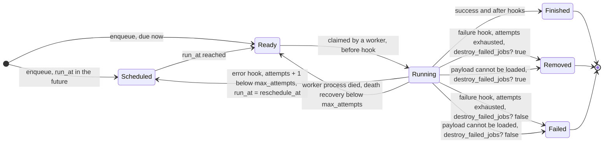

# Retries, failures and run time

Failed jobs retry with delayed_job's defaults: 25 attempts with a `5 + attempts**4` second back-off. Payloads can override `max_attempts`, `reschedule_at`, `max_run_time` and `destroy_failed_jobs?`, just as in delayed_job. Retries are scheduled Solid Queue jobs that keep the same Active Job id, and `attempts` is stored as Active Job's `executions`.



## What happens when a job raises

The job's `perform` in Solid Queue runs `Delayed::Worker#run(job)`, just as delayed_job's worker loop does:

1. `invoke_job` runs the `before`, `perform`, `success`, `error` and `after` hooks, bounded by `max_run_time`.
2. On an exception, the `:error` lifecycle event wraps the failure handling: `job.error = exception` (fills `last_error`), then a log line `Job NAME (id=ID) (queue=Q) FAILED (N prior attempts) with Class: message`.
3. `reschedule(job)`: `attempts` is incremented. If it is below `max_attempts(job)`, the job is stored again with `run_at = job.reschedule_at` and `retry.delayed_job` is published.
4. Otherwise it logs `FAILED permanently because of N consecutive failures` and calls `failed(job)`.

`failed(job)` runs the `:failure` lifecycle event and the payload's `failure` hook. An exception in the hook is logged at `error` level (`Error when running failure callback: ...`) and does not stop the job from being removed or failed. Then:

- `destroy_failed_jobs?` true: the job is removed.
- false: Solid Queue keeps it as a failed job with the exception class, message and backtrace. It shows up in `SolidQueue::Admin.jobs(status: :failed)` and Mission Control, and can be retried or discarded there.

## Settings

| Setting | Default | Per-job override | Effect |
|---|---|---|---|
| `Delayed::Worker.max_attempts` | 25 | payload `max_attempts` | Total runs before the job fails permanently |
| `reschedule_at` | `now + attempts**4 + 5` | payload `reschedule_at(now, attempts)` | Time of the next attempt |
| `Delayed::Worker.destroy_failed_jobs` | true | payload `destroy_failed_jobs?` | Remove, or keep as a failed Solid Queue job |
| `Delayed::Worker.max_run_time` | 4 hours | payload `max_run_time` (capped at the worker value) | Run-time limit for one attempt |

`job.max_attempts`, `job.max_run_time` and `job.destroy_failed_jobs?` return the payload's value (or nil / the worker default) exactly as delayed_job's `Delayed::Job` did, and `worker.max_attempts(job)` / `worker.max_run_time(job)` resolve the effective value.

## `max_run_time`

An attempt that runs longer than `max_run_time(job)` is interrupted with `Delayed::WorkerTimeout`:

```
execution expired (Delayed::Worker.max_run_time is only 60 seconds)
```

`timeout.delayed_job` is published with the job details and `max_run_time`, and the timeout then goes through the normal failure path: it is rescheduled while attempts remain.

`Delayed::Worker.max_run_time` also becomes the Solid Queue run-time limit of `Delayed::JobWrapper` (`Delayed::JobWrapper.run_time_limit`, the `limits_run_time` setting), so Solid Queue's watchdog records a deadline on each delayed_job claim and supervisor maintenance fails a job stuck past it even if its thread never returns. Only delayed_job jobs get this limit: `SolidQueue.max_run_time` and the app's other Active Job classes keep their own settings. A payload's shorter `max_run_time` is enforced inside the attempt.

## Worker death

delayed_job re-runs jobs whose worker died, once their lock expires. On Solid Queue, jobs claimed by a process that dies, is killed or stops heartbeating are failed with `ProcessPrunedError`, `ProcessExitError` or `ProcessMissingError`. The shim gives `Delayed::JobWrapper` Solid Queue's per-job death recovery with the same cap as `max_attempts`:

```ruby
Delayed::Worker.max_attempts = 10
Delayed::JobWrapper.process_death_attempts
```

Each such delayed_job job goes back to ready while its `executions`, counting the interrupted run, is below the cap. The setting is applied when the app boots and on every change to `max_attempts`; a non-positive or non-integer `max_attempts` clears it. `SolidQueue.retry_on_process_death` and the app's other Active Job classes keep their own settings.

## Delivery modes

Each delayed_job job carries a delivery mode, which Solid Queue stores when the job is enqueued:

| Mode | Guarantee |
|---|---|
| `:exactly_once` | The default for delayed_job jobs. The perform and the job's completion share one queue-database transaction, so the job is recorded as run once. |
| `:at_least_once` | Solid Queue's default for other Active Job classes. A job interrupted by a crash runs again. |
| `:at_most_once` | A job interrupted by a crash is not run again. |

The mode is resolved in this order:

1. The `delivery_mode:` option: `user.delay(delivery_mode: :at_least_once).sync`, `handle_asynchronously :sync, delivery_mode: :at_least_once` (a proc works too), or `Delayed::Job.enqueue(job, delivery_mode: :at_least_once)`. It is stored with the job and kept across retries.
2. A `delivery_mode` method on a custom job object.
3. `Delayed::Worker.delivery_mode`, `:exactly_once` unless set (`DEFAULT_DELIVERY_MODE`, restored by `Delayed::Worker.reset`).

For delayed method calls (`delay`, `handle_asynchronously`), use the option. A `delivery_mode` method or attribute on the target object is left alone, so a model with a `delivery_mode` column keeps working. Unknown modes raise `ArgumentError` when set or enqueued. `Delayed::Worker.delivery_mode` only affects delayed_job jobs; other Active Job classes keep `SolidQueue.default_delivery_mode`.

`:exactly_once` keeps one queue-database transaction open for the whole perform, capped at `SolidQueue.exactly_once_timeout` (60 seconds by default). Use `:at_least_once` for jobs that run longer, and make them idempotent:

```ruby
class ReportJob
  def perform = build_the_big_report
  def delivery_mode = :at_least_once
end

Delayed::Worker.delivery_mode = :at_least_once
```

## Notifications

Subscribe with `ActiveSupport::Notifications.subscribe(/\.delayed_job\z/)`. Every payload has `display_name`, `job_id` (the Active Job id, `Delayed::Job#active_job_id`, which stays the same across retries), `queue`, `priority` and `attempts`:

| Event | When | Extra keys |
|---|---|---|
| `enqueue.delayed_job` | A job is stored | none |
| `perform.delayed_job` | Around each attempt | `success` (true or false) |
| `retry.delayed_job` | A failed attempt is rescheduled | `run_at`, `error` |
| `failure.delayed_job` | Attempts are exhausted or the payload cannot be loaded | `error` |
| `timeout.delayed_job` | An attempt exceeded `max_run_time` | `max_run_time` |

Solid Queue's own `*.solid_queue` events (claim, perform, failure, `run_time_exceeded`, `death_recovery`) are published too.
