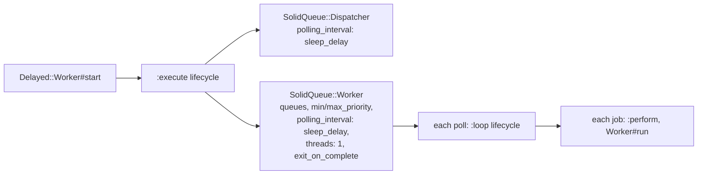

# `Delayed::Worker`

`Delayed::Worker` keeps delayed_job 4.2's settings, constants and methods. Each setting either maps to a Solid Queue option or is applied by the shim, and a worker started with `start` or `work_off` runs jobs through Solid Queue on either backend.

## Settings

Set them in an initializer, as with delayed_job:

```ruby
Delayed::Worker.max_attempts = 10
Delayed::Worker.max_run_time = 30.minutes
Delayed::Worker.destroy_failed_jobs = false
Delayed::Worker.queue_attributes = { mailers: { priority: -5 } }
```

| Setting | Default (constant) | On Solid Queue |
|---|---|---|
| `max_attempts` | 25 (`DEFAULT_MAX_ATTEMPTS`) | Shim retry policy; also the death-retry cap of `Delayed::JobWrapper` (`retries_on_process_death attempts: max_attempts`) |
| `max_run_time` | 4 hours (`DEFAULT_MAX_RUN_TIME`) | Per-attempt timeout; also the Solid Queue run-time limit of `Delayed::JobWrapper` for the watchdog |
| `destroy_failed_jobs` | true | Remove exhausted jobs, or keep them as failed Solid Queue jobs |
| `sleep_delay` | 5 (`DEFAULT_SLEEP_DELAY`) | `polling_interval` of the worker and dispatcher that `start` runs |
| `min_priority` / `max_priority` | nil | Worker `min_priority` / `max_priority`; `work_off` claims only that range |
| `queues` | `[]` (`DEFAULT_QUEUES`) | Worker `queues`; empty means `"*"` |
| `read_ahead` | 5 (`DEFAULT_READ_AHEAD`) | Stored; Solid Queue claims up to its free pool capacity |
| `exit_on_complete` | nil | Worker `exit_on_complete`: `start` returns once no due job is left |
| `default_priority` | 0 (`DEFAULT_DEFAULT_PRIORITY`) | Priority of jobs enqueued without one |
| `default_queue_name` | nil | Queue of jobs enqueued without one (Solid Queue's `default` when nil) |
| `queue_attributes` | `{}` (`DEFAULT_QUEUE_ATTRIBUTES`) | `{ queue => { priority: n } }` sets the priority of jobs in that queue; stored with indifferent access |
| `delay_jobs` | true (`DEFAULT_DELAY_JOBS`) | false runs jobs inline at enqueue; a proc decides per job |
| `logger` | nil | Destination of `say`; `SolidQueue.logger` when nil |
| `default_log_level` | `"info"` (`DEFAULT_LOG_LEVEL`) | Level of `say` and `job_say` |
| `delivery_mode` | `:exactly_once` (`DEFAULT_DELIVERY_MODE`) | Delivery mode Solid Queue stores for delayed_job jobs; one of `DELIVERY_MODES`. See [delivery modes](retries.md#delivery-modes) |
| `plugins` | `[Delayed::Plugins::ClearLocks]` | See [lifecycle](lifecycle.md) |
| `raise_signal_exceptions` | false | `start`'s TERM/INT handling: false stops after the current job, `:term` raises on TERM, true raises on both |
| `backend` | `Delayed::Backend::SolidQueue::Job` | `backend=` accepts `:solid_queue` or a class; `:active_record` and `:mongoid` map to Solid Queue with a deprecation warning; other symbols raise `ArgumentError` |

Settings apply to delayed_job jobs only; the app's other Active Job classes and Solid Queue's global settings keep their own values.

`Delayed::Worker.reset` restores `default_log_level`, `sleep_delay`, `max_attempts`, `max_run_time`, `default_priority`, `delay_jobs`, `queues`, `queue_attributes`, `read_ahead` and `delivery_mode` and drops the lifecycle, as in delayed_job. Instance readers and writers (`worker.queues = [...]`) change the class settings.

## Creating a worker

```ruby
worker = Delayed::Worker.new(queues: %w[ mailers default ], min_priority: 0, max_priority: 10, sleep_delay: 1, exit_on_complete: true, quiet: false)
```

`initialize(options = {})` copies `min_priority`, `max_priority`, `sleep_delay`, `read_ahead`, `queues` and `exit_on_complete` to the class settings when given, sets `quiet` (default true: no stdout), and rebuilds the lifecycle.

`name` is `"#{name_prefix}host:HOSTNAME pid:PID"` (or `"#{name_prefix}pid:PID"` if the hostname is unavailable); `name=` overrides it and `name = nil` restores the default.

## `start`

`start` runs a Solid Queue worker and dispatcher in the calling process until `stop` is called, TERM or INT arrives, or (with `exit_on_complete`) no due job is left:



- The dispatcher moves scheduled jobs (future `run_at`, retries) to ready.
- One worker thread runs jobs one at a time, like a delayed_job worker. For more throughput run `bin/jobs` with Solid Queue's `config/queue.yml`.
- It logs `Starting job worker`, and `No more jobs available. Exiting` when it drains.
- The previous TERM and INT handlers are restored when `start` returns.

## `work_off(num = 100)`

```ruby
successes, failures = Delayed::Worker.new.work_off
```

Runs up to `num` due jobs from the worker's queues and priority range in the calling thread, then returns `[successes, failures]`. Scheduled jobs whose `run_at` has passed are dispatched first. A job counts as a failure when its attempt raised, whether it was rescheduled, removed or kept as failed. It stops early after `stop`.

It uses `SolidQueue.work_off(queues:, limit:, priority:)`, which registers a transient Solid Queue worker process for the duration. Errors while claiming are logged (`Error while reserving job: ...`) and passed to `Delayed::Job.recover_from`; ten in a row raise `Delayed::FatalBackendError`.

## `delay_jobs`

```ruby
Delayed::Worker.delay_jobs = false
Delayed::Worker.delay_jobs = ->(job) { job.queue != "inline" }
Delayed::Worker.delay_jobs = -> { Rails.env.production? }
```

`Delayed::Worker.delay_job?(job)` evaluates the setting. When it is false, `Delayed::Job.enqueue`, `delay` and `handle_asynchronously` run the job immediately through `invoke_job` (hooks included) and store nothing.

## Running jobs by hand

| Method | delayed_job behaviour |
|---|---|
| `run(job)` | Runs one attempt with `max_run_time`, logs `RUNNING` / `COMPLETED after 0.1234`, removes the job; on error runs the failure path and returns false |
| `reschedule(job, time = nil)` | Increments attempts, stores the job again at `time` or `job.reschedule_at`, or fails it after `max_attempts` |
| `failed(job)` | Runs the `failure` hook, then removes the job or keeps it as failed |
| `max_attempts(job)` | `job.max_attempts` or `Delayed::Worker.max_attempts` |
| `max_run_time(job)` | `job.max_run_time` or `Delayed::Worker.max_run_time` |
| `stop`, `stop?` | Ask the worker to stop after the current job |

See [retries](retries.md) for the failure path.

## Logging

- `say(text, level = default_log_level)` writes `"[Worker(NAME)] text"` to stdout unless quiet, and `"#{Time.now.strftime('%FT%T%z')}: [Worker(NAME)] text"` to the logger at `level`. Integer levels (0 to 5) map to `debug` through `unknown`.
- `job_say(job, text, level)` prefixes `"Job NAME (id=ID) (queue=QUEUE) "`, leaving out the queue when it is nil.

## Forking and reloading

- `Delayed::Worker.before_fork` records open files and calls `backend.before_fork`.
- `Delayed::Worker.after_fork` reopens them in append mode, calls `SolidQueue.after_fork!` (fresh MongoDB client on that backend) and `backend.after_fork`.
- `Delayed::Worker.reload_app?` is true when Rails reloads code (`cache_classes == false`).
- `guess_backend` prints its deprecation warning and does nothing else.

## Lifecycle

`Delayed::Worker.lifecycle` returns the shared `Delayed::Lifecycle`, created on first use; `setup_lifecycle` rebuilds it and instantiates `plugins`. See [lifecycle](lifecycle.md).
